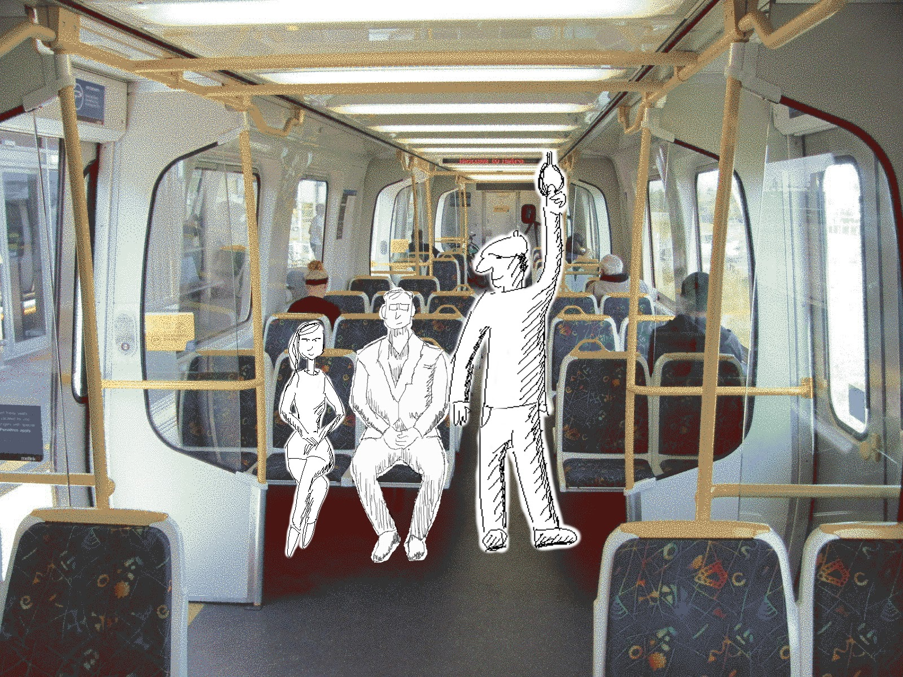
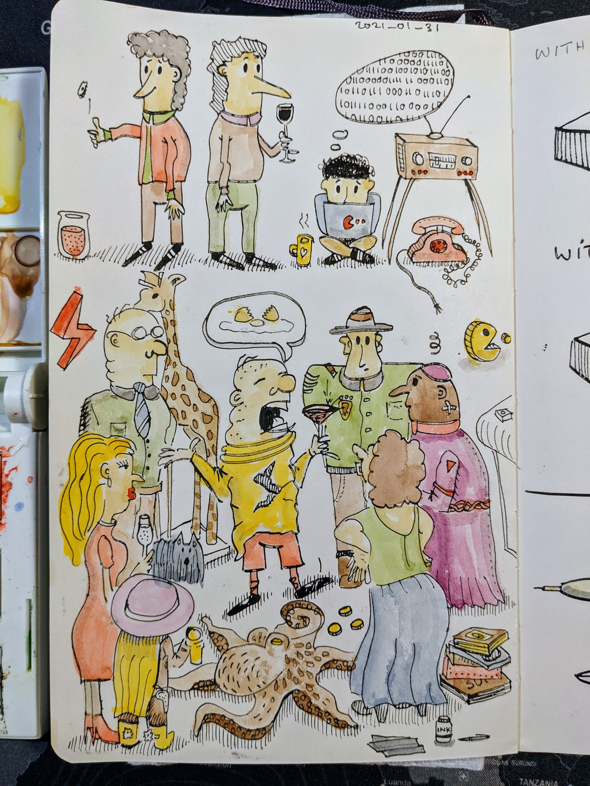

# Game Mechanics

You play cards to "bustle" with "enemy" commuters, and bustling includes things like bumping elbows, or generally doing annoying things in the vicinity of the enemy.

# Genre

Deck-building / rogue-lite.

If at any time your **Annoyance Meter** falls to zero (i.e. your character is fully annoyed), you pass out, and wake up in a hospital near your home, which means you have to start the journey over again. So, I guess there's a "permadeath" element of the roguelike genre in there.

# Player Fantasy

We have 2 fantasies:

"I'm a commuter on the receiving end of pushes, shoves, loud music and smelly food. This game will let me fight back!"

"I'm a loving pet owner, and my pet is kidnapped, and I go on a hero's journey to retrieve them."

(This is informed by the [narrative design](narrative.md).)

# Platform and Controls

Initially: PC -> keyboard/mouse.

# Spatial Abstraction

A two-dimensional (2D) staging space for the characters using a cartoonified representation of the locations on public transport. (I use "staging space" instead of "play space" as the player doesn't interact/use the avatar directly, but rather via the cards.) The map represents a physical map, and the player can select the next waypoint using the controller (or tapping), instead of navigating their avatar there.

# Avatar

The player is represented by an avatar in the 2D staging space, controlled by the hand of cards next to the staging space. The avatar might initially just be modelled on me, or one of my daughters.

# Camera Perspective

A locked side view with both avatar and enemies (facing off) visible in the staging space. The backgrounds are locations on public transport which seem to use single-point perspective to add a bit of depth.

# Goals and Scores

The ultimate goal is to journey to the final destination using all the modes of transport, battling enemies on the way, and ultimately defeating the boss on every level. 

Gather points towards unlocking new "tricks" and cards. (A "trick" is like a relic in Slay The Spire, and is a special skill you have "up your sleeve", so to speak.)

# Progression and Variety

The player journeys from A to B, one stop at a time. A location can be the interior of a mode of transport, or non-battle like a newsstand (for buying things). Each new enemy encounter poses a stronger enemy with different attacks and tricks.

# Tension and Rest

The game is turn based, so you can take a breather between turns to gather your thoughts and plan your next move. Also, not every location on the journey is a battle arena, e.g. you can choose a branch in your journey which takes you to a station with a newsstand, so you can buy a sandwich or sweeties, to heal and restore energy.

(Even if combat levels are continuous time instead of turn-based, there'll still be moments of rest in-between battles.)

# Obstacles and Penalties

The player does not know what lies ahead, and every battle area of the journey reveals a new fellow passenger, or group of passengers. The elite areas has stronger passengers with better rewards when defeated. The game is turn based, so the NPC passengers "play" as many times as you do, whether you choose to attack or not, or protect yourself or not.

The skill and strategy lies in how you build your deck, and which tricks you acquire. There is definitely a balance of risk and reward, e.g. you can choose to play a card which buffs you and debuffs your enemy, and then attacking to greater effect when the enemy is weaker.

# Resources

A hand is dealt from your deck at the start of every encounter, so for the duration of the battle, your deck is your most valuable resource (apart from health points, of course), and for the duration of the turn, it's the hand you were dealt. You "spend" a card when you play it, and it goes into your discard pile. Your opponent can play tricks which effectively nullifies one of your cards.

You can gather ticket stubs (or travel credits) after defeating other passengers, and this can be used at the newsstands. You can collect or purchase tricks along your journey, which are persistent, and have lasting effects (such as unique abilities) as long as you're journeying. You can also collect or purchase tricks, which are single use, and can be used to increase health or buff your next attack.

# Decisions

The player chooses which new cards to add to their decks at the end of every encounter. The player chooses whether to spend their credits on new cards or tricks when visiting the newsstand. The player chooses which branch to take when taking the journey, e.g. do we visit train station with the newsstand next, or battle another enemy?

And most importantly, at each turn, the player chooses which cards to play.

# Simulation and Chance

The player is dealt a random hand every turn. A play-through is random as per the generated random seed for that play-through, which affects what your map looks like, which other passengers you encounter, and what the newsstands will have on offer. I'm not too sure if the enemy decisions are random (e.g. if they're also dealt a restricted "hand" per turn), but they certainly seem to make educated decisions (e.g. healing instead of attacking if their health is low).

# Storytelling

(None of this is set in stone. See [narrative design](narrative.md).)

An adventure: You find a note through your letterbox: your cat has been kidnapped. Meet at location X and bring ransom. You embark on your journey using public transport. However, you're mad, you're angry, and you're not your usual polite self. Every train ride is a bustle as you go head-to-head with other angry commuters.

Modern day, somewhere in a city which has many modes of transport. NPCs are other commuters, or the person running the newsstand.

The story is told using images, cut-scenes that look like comic strips, dialogue, and taunts during battle.

# Art Direction and Style

2D, mostly black & white, hand-drawn / illustrated scenes and characters (like ink lines in comics), with light touches of water colour where appropriate (perhaps to highlight items, or to make the cards stand out). Colour is from a very small palette.

The characters aren't drawn from life, and aren't realistic. They are more cartoony, with exaggerated features for comic effect. The locations are the interiors of modes of public transport.

An initial prototype actually used photographs of public transport interiors:

Being a [Tintin](https://en.wikipedia.org/wiki/The_Adventures_of_Tintin) fan, this style appeals to me, as Tintin is cartoony, but the scenes and backgrounds can be very realistic and detailed. 

However, interiors and station locations are hand-drawn too.

Here are some example characters [drawn recently](https://twitter.com/opyate/status/1356395395321069569) using fountain pen (black ink lines) and coloured with water colour:

# Animation and Visual Effects

The hand-drawn aspects of the game isn't animated during battle, but there are particle affects, and static images move across the screen from time to time, e.g. when new cards are dealt, the cards move across the screen from the deck to the "hand" area at the bottom.

The avatar is animated at the end of every battle scene, and either does a happy jig when victorious, or cries in a hospital bed with the picture of his/her kidnapped cat on the side-table.

# Sound Design

The music has the rhythmic qualities of being on a train, and is procedurally generated. The music fits the mood, e.g. tranquil during the transition scenes (map), and exciting during the encounter scenes.

SFX are custom recorded to fit each action.