# Intro

Borrowing from Lee Petty, the 4 Fs are:

## Frame

When? Modern day (or modern enough to have planes, trains and automobiles).
Where? A metropolis on a fictional earth-like planet inhabited by humanoids.

## Form

Shapes are organic, rounded, exaggerated.
Colours are limited: lines are drawn with near-black (colour on left below), and 4 colours, on yellowed paper texture.

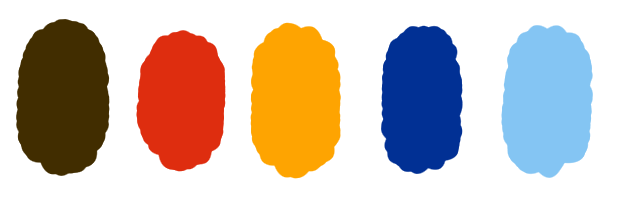

## Focus

Everything will be illustrated, or have an illustrated look. The world will feel alive, due to the [SquiggleVision](https://en.wikipedia.org/wiki/Squigglevision) idle animation style.

## Filter

The world will have an element of absurdity to it, e.g. out-of-place objects, or organic art deco architecture. Everything will be related to the commute and modes of transport, e.g. you don't walk to the bus stop - a pneumatic tube takes you there in an instant. And comics!

# Mood boards

See the mood boards here (recommended, as some pictures are animated):

https://miro.com/app/board/o9J_lU5g0qg=/

## Architecture

Organic art deco with plenty of vaulted ceilings.

## Absurd

Out-of-place objects, and other weirdnesses.

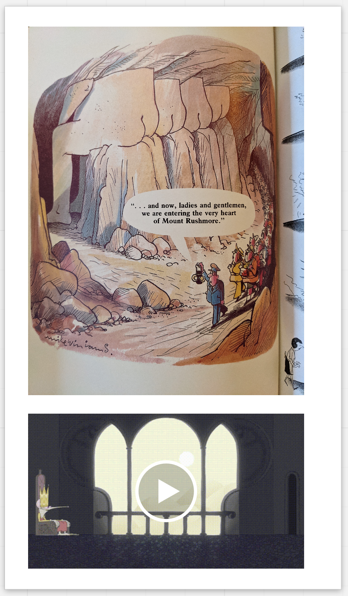

## Style

Muted (line work on off-white paper texture), with accent colours. Illustrated look. Art will looked scanned-in (and probably will be).

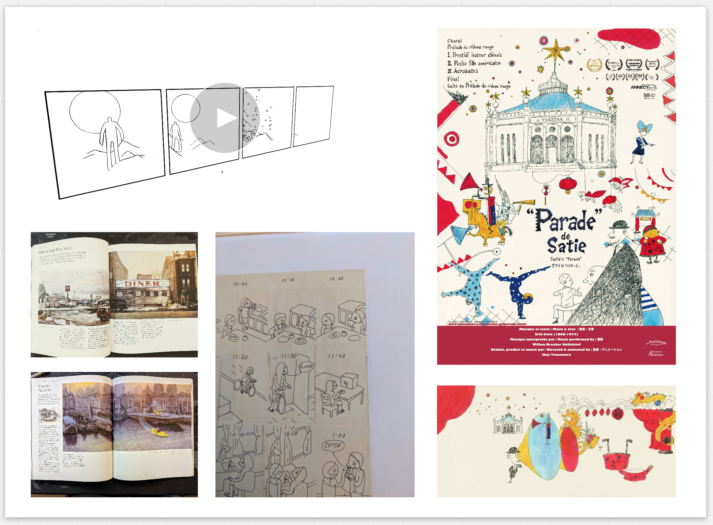

## Characters

Richly inspired by [Mattias Adolfsson](https://mattiasadolfsson.com/).

# Concept art

## Character development

The protagonist's lines developed and evolved first.

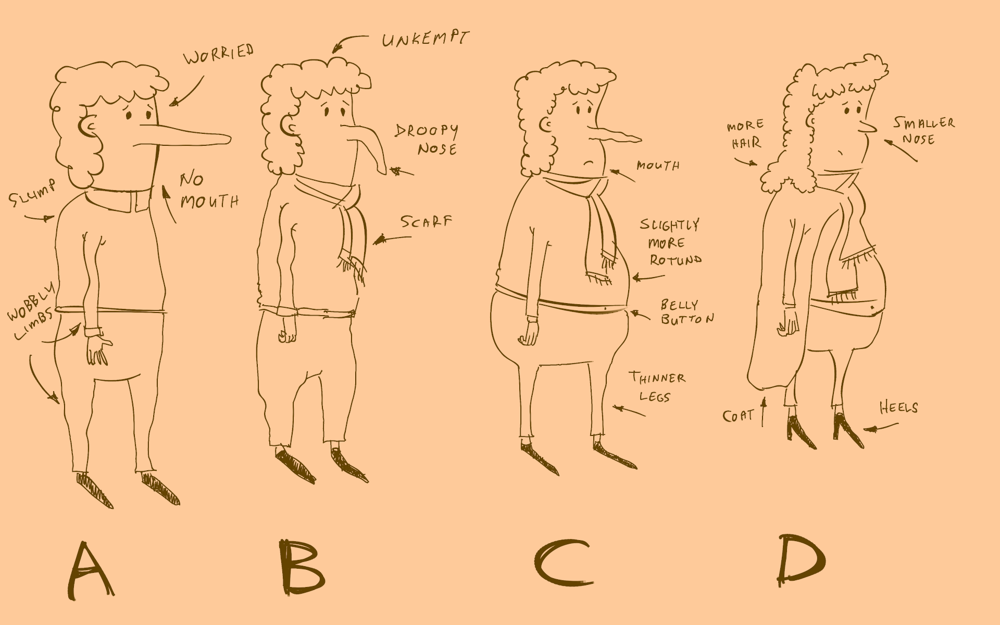

A silhouette emerged, or perhaps this is the silhouette we're aiming for. Not a super-hero figure.

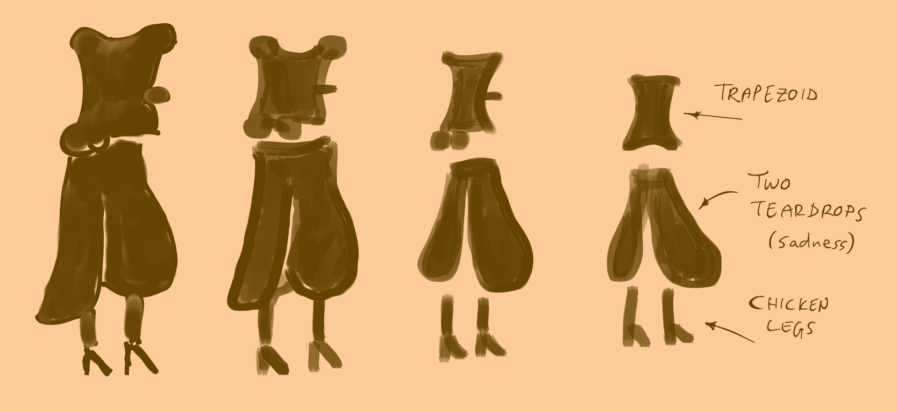

Some colour experiments.

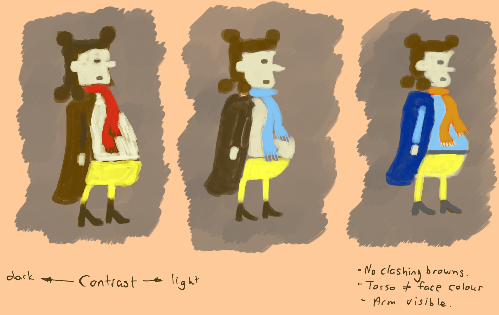

Some desaturation experiments on the previous colours to see if there's enough contrast and it the character reads well from a value perspective.

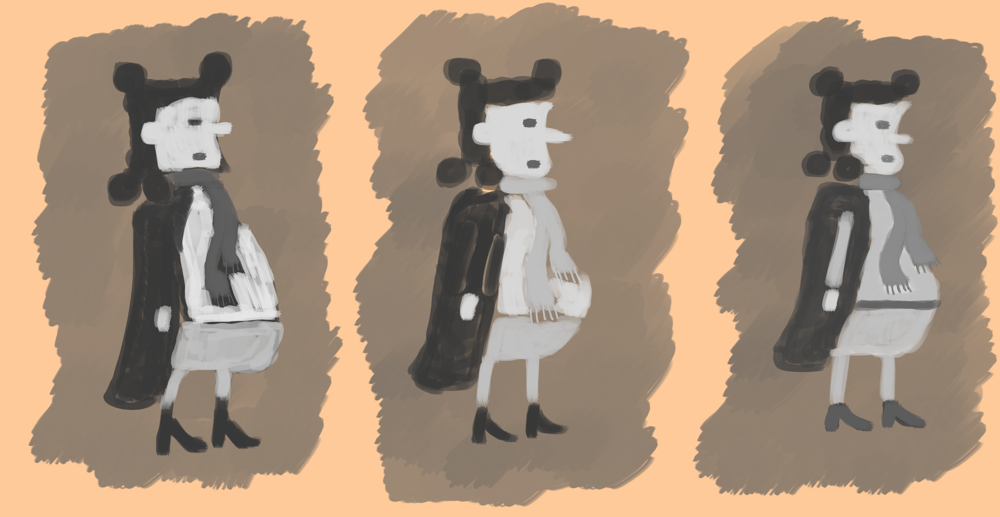

Elaborating on the line work from before.

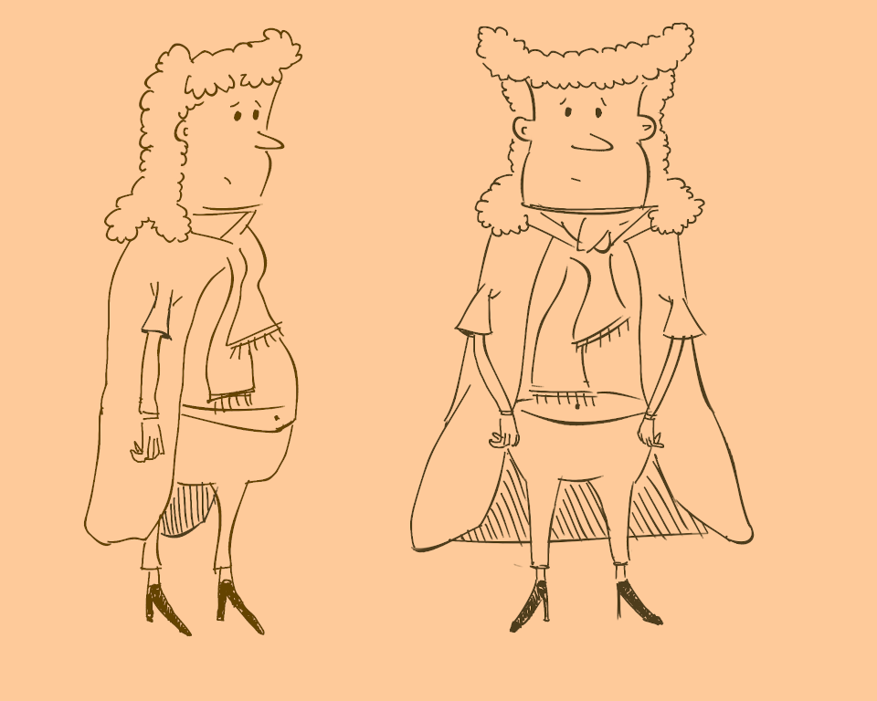

The new line work with some colour.

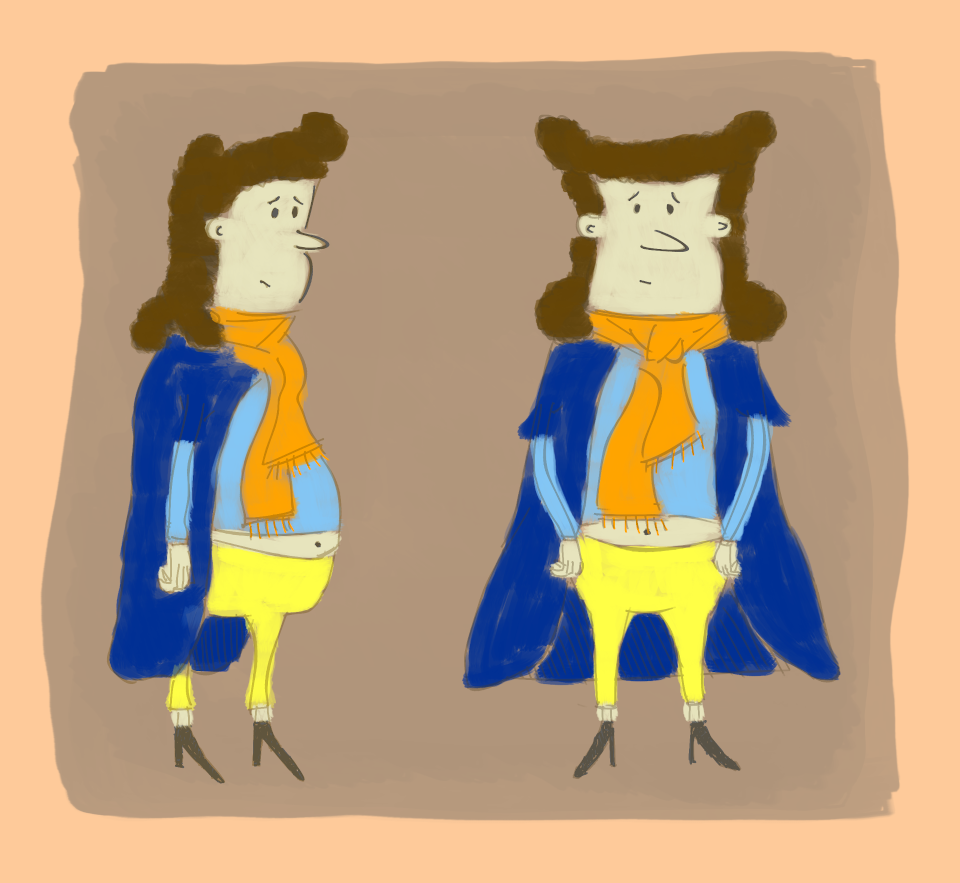

And desaturated.

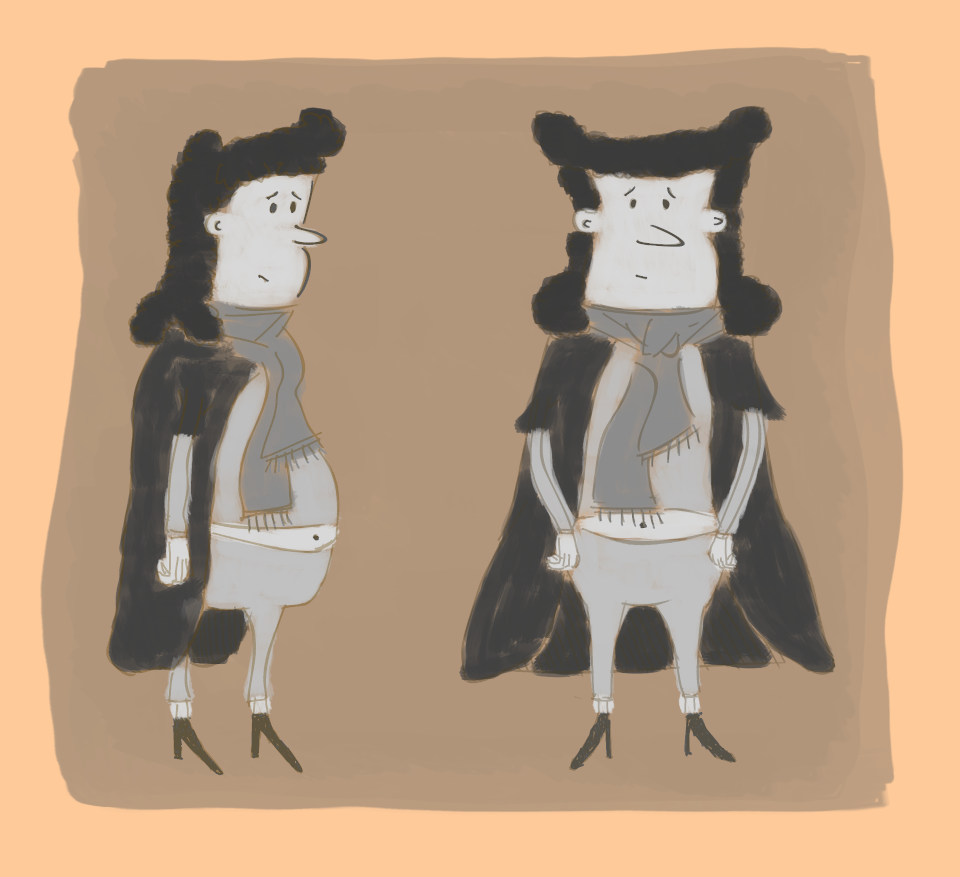

Riffing on the companion. The soft face with droopy nose seems cute.

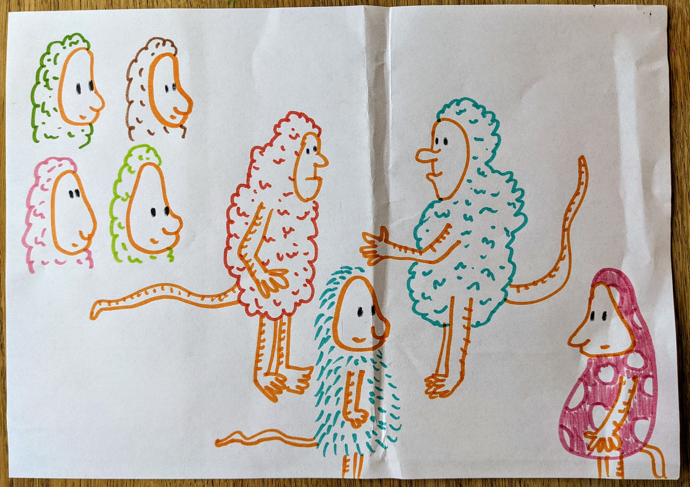

Experimenting with patterns and textures, as we feel we don't want to use colour everywhere on a character.

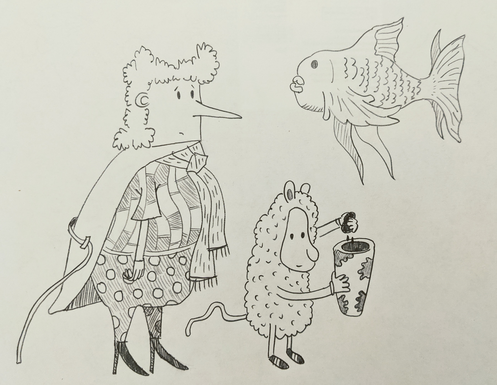

A somewhat final render, showing a tiny bit of environment (a patch-work tile floor).

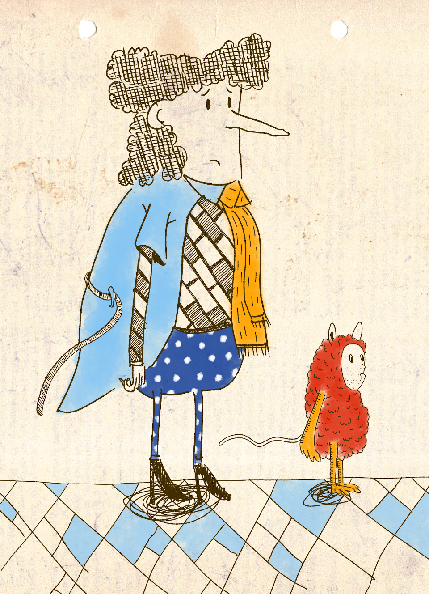

TODO show renders with speech bubbles. (The bubbles will be "drawn" on their own "pieces of paper" and have a slight drop-shadow in the scene.)

## Environments

TODO week 8

# Cutscenes (via comics)

(This is also on the mood board.)

We want a comic look, but with depth: the panels tilt and shift on input. Dialogue everywhere will be in speech bubbles.

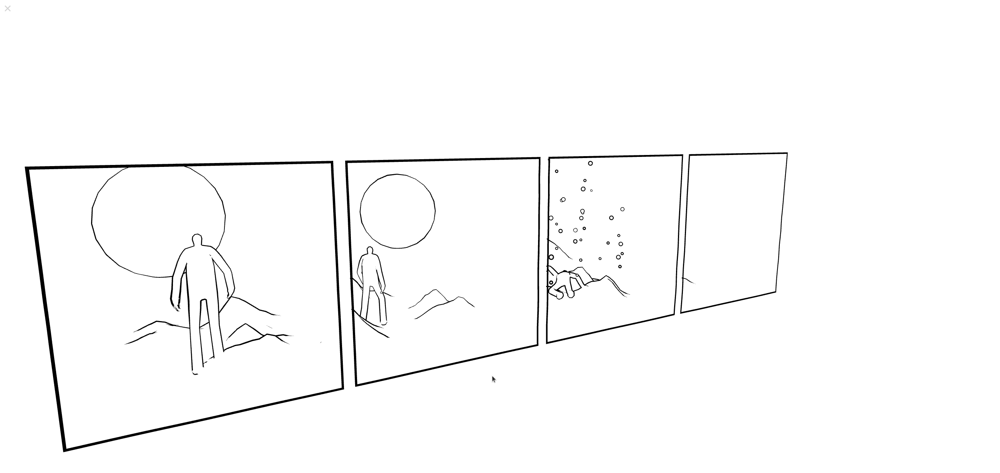

# Animation

TODO week 7

Cel + outline shader, which might be a good shortcut so we can avoid drawing/illustrating a lot of stuff. (Even though I want everything to seem genuinely drawn.)

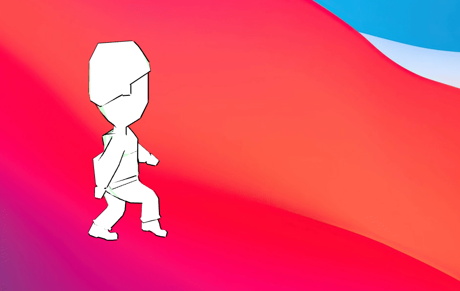

SquiggleVision demo, from an old prototype.

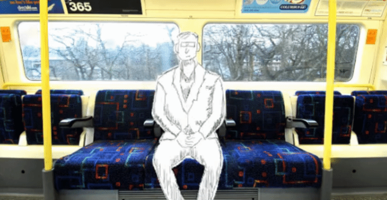

# Colour script

TODO I'll have a clearer idea of this after week 8.