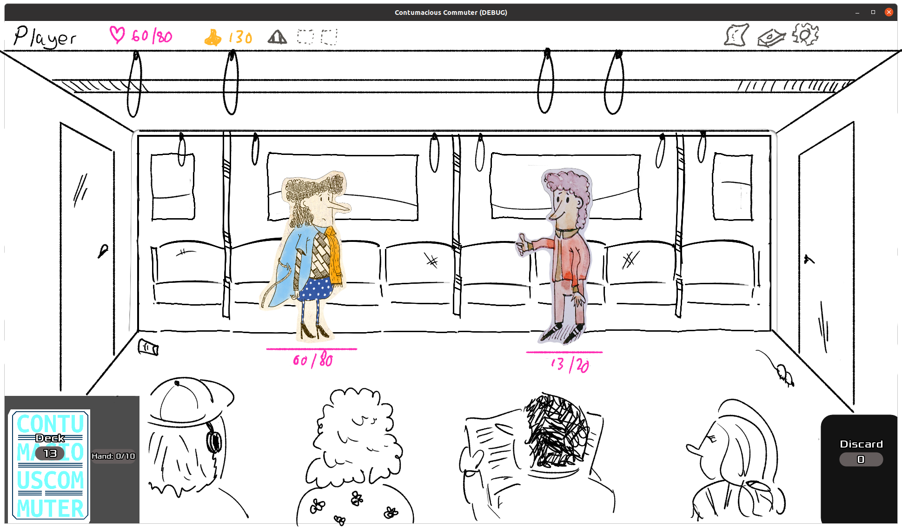
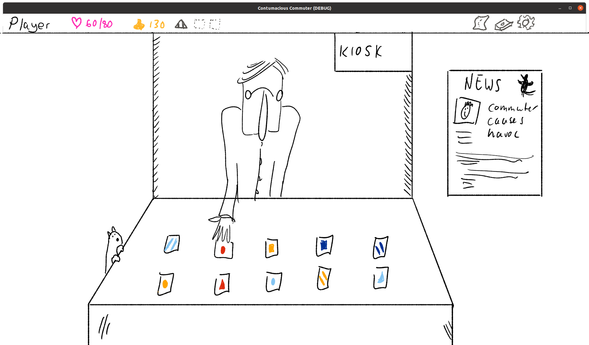

# Introduction

As mentioned before, Contumacious Commuter is inspired by deck-building and card games like Slay The Spire and Monster Train.

For the record, this version of the level design document will be very rough-and-ready. I just didn't have time to iterate on designs, or read (much) around the subject this week, and I'm drawing from previous experience and stuff I've read before.

# Game areas

## Battle arenas

The battle arenas are the interiors of public transport (only trains at the time of writing). Characters may be standing or seated. The train will be moving, and this is evident by the parallax scrolling over the outside world through the windows. The straphangers might sway to and fro to indicate the swaying of the train's mass.

The interiors will be hand-rendered illustration using monochrome colour schemes (black line on white background), with accent colours (perhaps only on characters). 

These interiors will be fairly standard train interiors, and will have slight variety from one level to the next, e.g. different levels of wear, different patterns on the seating, different fellow commuters (onlookers), etc.

## Merchant

The merchant will be encountered on the platform at train stations. Again, rendered monochrome, with accent. The only playable interaction is the selection of goods, and upon clicking, money is deducted from your purse/wallet.

## Final level

As mentioned before, the final level could be a cliff-hanger: the pet could decide to not come back, and stay with the antagonist instead. It would not have made sense to have all battles take place on public transport just for the final battle not to. That said, there doesn't need to be a final battle. The antagonist can just say something like "I didn't think you'd make it this far. Here - take it back", and they end up releasing the pet.

This scene can play out in an abandoned space, like a parking lot, or on a train platform, etc.

# Progression

The journey is dictated by a map with 10 locations (levels) along the way, each presenting one of the antagonist's henchmen, and getting progressively more difficult. Levels are represented by train interiors, and after each battle, if you've won, the train stops and you can visit the kiosk on the platform. If you've lost, you wake up in your bed at home, and you have to start over.

The player can't back-track, and one level follows another in strict order.

Progression is aided by collecting stronger cards, more elaborate "tricks" (relics in Slay The Spire), and stronger "consumables" (potions in Slay) like sweeties or fizzy drink or aspirin (no idea, actually - I haven't given this much thought). The opportunity to get better/more cards, tricks or consumables are only presented when visiting the kiosk, so only after a foe has been defeated.

There's a meta-game in the sense that the player can pair certain cards with certain tricks for more powerful combinations.

# Narrative

The story is that you're journeying to a certain location to fetch your pet, and that the kidnapper tries to stop you from getting there by sending their friends to battle you. The train interiors represent the journey the protagonist is making, and the foes have to be defeated to progress. It's a straight-forward story with straight-forward in-game locations and characters to represent the main subjects in the story (the commute and foes).

